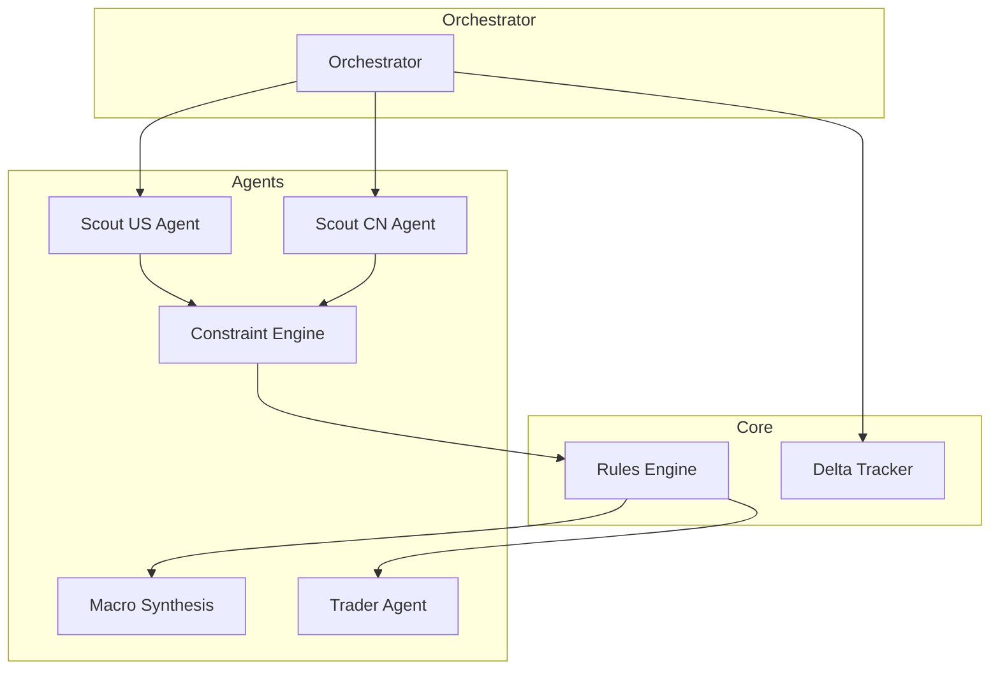

# AI Infra Sentinel

## Project Description
**AI Infra Sentinel** is a bilingual (English/Portuguese) AI compute supply chain monitoring platform. It acts as an autonomous macro-trading dashboard that scans and monitors critical infrastructure bottlenecks for artificial intelligence data centers, power generation, networking, and supply chain domains.

**Sentinela de Infraestrutura de IA** é uma plataforma bilíngue de monitoramento da cadeia de suprimentos de computação. Ela funciona como um painel autônomo de macro-operações e ideias de negociação que rastreia continuamente os gargalos de infraestrutura crítica em data centers, energia, redes e na cadeia de abastecimento global (EUA e China).

## Architecture



## Setup Instructions

1. **Database Setup**
   The application uses PostgreSQL with asyncpg connection pooling.
   Ensure PostgreSQL is running on port 5432 or utilize the included Docker Compose configuration.

2. **Install Python Packages**
   ```bash
   pip install --no-cache-dir -r requirements.txt
   ```

3. **Configure Environment Variables**
   ```bash
   cp .env.example .env
   # Edit .env with your LLM API keys.
   ```

## Usage

**Run the orchestrator scanner manually:**
```bash
python orchestrator.py
```

**Run the Streamlit Dashboard:**
```bash
streamlit run dashboard/app.py
```

## Deployment

Deployment configuration consists of a Docker compose setup intended for VM hosting (such as Oracle Cloud).

```bash
docker-compose up -d
```
